# The Zen of Typing

#### [Live link to deployed project](https://zen-of-typing.herokuapp.com/)

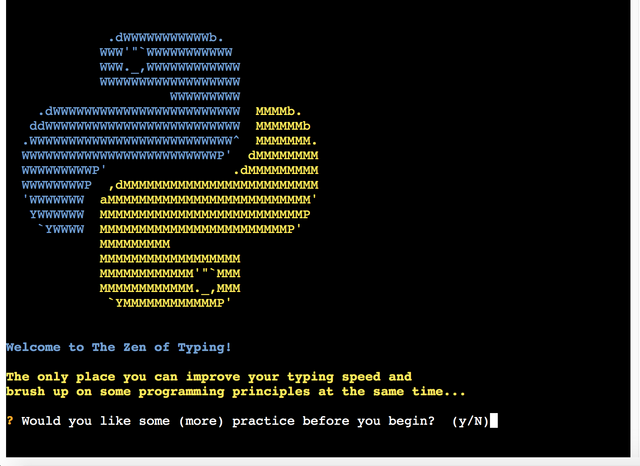

**[The Zen of Typing](https://zen-of-typing.herokuapp.com/)** is a Python terminal project whose primary purpose is to enable users to practice and improve their touch typing skills.

Secondarily, it serves to reinforce various (mainly Python-related) programming principles and aphorisms through the use of carefully-selected practice texts and extracts.

Users can customise their experience by choosing from a range of options before the game itself gets underway. Once all necessary pre-game instructions have been displayed and the target text is loaded, the user's performance is monitored as they attempt to replicate each line of text. As soon as they finish and hit **Enter**, they receive feedback in the form of a breakdown of their typing speed and accuracy. They may then choose to either restart the game or quit (and exit the application).

## How to play

<details>
    <summary>
    click to view
    </summary>

The Zen of Typing is loosely modelled on classic typing programmes such as ['Mavis Beacon Teaches Typing!'](https://en.wikipedia.org/wiki/Mavis_Beacon_Teaches_Typing), which the developer was known to spend countless hours practicing throughout his misspent youth.


The title is also a play on ['The Zen of Python'](https://www.python.org/dev/peps/pep-0020/), Pythoneer [Tim Peters'](https://en.wikipedia.org/wiki/Tim_Peters_(software_engineer)) list of fundamental commandments for the then-nascent programming language, which was first issued in 1999 and has since come to be seen as something of a cornerstone document.

To begin, a welcome message is communicated on the start screen and the user is asked if they would like to warm up by tackling a practice text (which is subsequently revealed to be [Tom Cargill's humorous observation now known as the 'ninety-ninety rule'](https://en.wikipedia.org/wiki/Ninety%E2%80%93ninety_rule)).

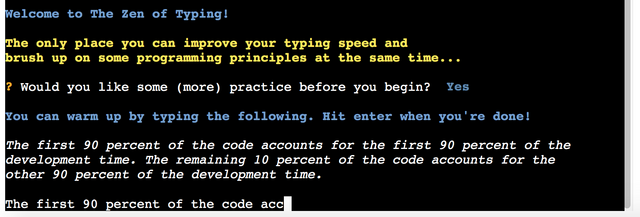

Following this optional practice session - which they can take as many times as they wish - the user is given a multiple-choice menu of target texts, from which they must choose one by using the Up, Down and Enter keys on their keyboard. There are six texts in all, each of which is denoted by a slightly cryptic title/acronym. If the user finds that they are struggling to decide on a text, they may opt to effectively 'roll the dice' by asking the computer to pick one at random for them.


Once a text has been chosen, a subsequent menu similarly asks the listener to choose from a range of options, this time corresponding to the number of lines they wish to type. The list is once again navigated using the Up, Down and Enter keys.


Having selected both a text and the number of lines to be typed, the user is next asked if they know the secret password. This time they must provide an answer by inputting either 'Y' or 'N' on their keyboard.


- If they **don't** know it, a summary of their choices is displayed and the target text is outputted in italics. A bold yellow "Off you go!!!" message signals that the game is underway and they must begin the typing task.


- If, on the other hand, they **do** know the secret password (and indicate so by pressing 'Y'), they are prompted to enter it as an input string.
  - If the password they enter happens to be incorrect, they are alerted to this fact by a bold red feedback message, after which the password functionality is discarded and the game begins in the usual fashion (see above)

  

  - If they enter a correct password, meanwhile, they unlock a bonus submenu offering the chance to acticate the 'Beast Mode' feature (explained in more detail below).

  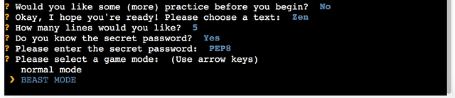

  
</details>

## Features

### Existing features:

<details>
  <summary>
  click to view
  </summary>


- #### Python-centric ASCII art hero image and colour scheme
  <details>
    <summary>
    click to view
    </summary>

  The prevalent blue and yellow design palette both draws the user's attention and reinforces the fact that this is very much a [Python](https://en.wikipedia.org/wiki/File:Python-logo-notext.svg) application. Elsewhere, semantic text feedback is displayed in a familiar and intuitive fashion, e.g. error messages in red, success alerts in green. While many terminal projects can look drab and monotone, it was the developer's intention that The Zen of Typing should be anything but.

  
    </details>

- #### Immersive sequential flow of multiple-choice menus and questions (enabled c/o the [PyInquirer module](https://github.com/CITGuru/PyInquirer))
  <details>
    <summary>
    click to view
    </summary>

  From a UX standpoint, the [closed-ended](https://en.wikipedia.org/wiki/Closed-ended_question) nature of almost all of the questions with which the user is presented minimises the risk of error and all but eliminates the possibility of invalid user input. This saves time (for both developer and user), while also delivering a neat and concise pre-game interface.
    </details>

- #### Warm-up/Practice option
  <details>
    <summary>
    click to view
    </summary>

  Not everyone is a super-fast expert typist. Similarly, not everyone produces their finest work under pressure. Bearing this in mind, The Zen of Typing allows users to practice their typing in a relaxed fashion without having to worry about performance metrics (the practice mode is not 'recorded', i.e. no speed/accuracy calculations are made). They may then progress to the stricter in-game conditions whenever they feel ready.

  
    </details>

- #### Randomised text selection fallback option
  <details>
    <summary>
    click to view
    </summary>

  [Hick's Law](https://lawsofux.com/hicks-law/) states that "the time it takes to make a decision increases with the number and complexity of choices". If, therefore, the user feels somewhat overwhelmed at having to choose between the six available target texts, they can simply ask the [random module](https://docs.python.org/3/library/random.html) to help lighten their cognitive load by deciding for them.

  
    </details>

- #### Programming-themed target text content
  <details>
    <summary>
    click to view
    </summary>

  Five of the six available target texts are directly related to computer programming, with a strong Python emphasis. While it would arguably have been simpler to work with generic/filler content, this way the Zen of Typing user stands to kill two birds with one stone (so to speak) by rounding out their coding knowledge as they're working on their typing speed.

  
    </details>

- #### API integration
  <details>
    <summary>
    click to view
    </summary>

  One of the five programming-related target texts mentioned above is actually a dynamically-generated random list of responses from an end-point associated with the [pyjokes ("jokes as a service") API](https://pyjok.es/).

  
    </details>

- #### Gamification
  <details>
    <summary>
    click to view
    </summary>

  One surefire way to drive user engagement is to harness the principles of [operant conditioning](https://en.wikipedia.org/wiki/Operant_conditioning) when designing an interactive application. The Zen of Typing adheres to this objective on at least two fronts:
  - The user is provided with instant feedback in the form of a results breakdown, consisting of overall time taken, accuracy and average speed (in words typed per minute). In most cases, this alone should be enough of a hook to encourage them to keep playing in the hope of improving on their current personal best score(s)

  

  - The secret password/'Beast Mode' functionality is initially alluded to in passing, but quickly becomes a central aspect of the game. Crucially, the user is never directly informed as to how and when the next character of this password will be revealed, so they are kept guessing (and wanting more) to a large extent.

  
    </details>

  - #### Input validation and error-checking
    <details>
      <summary>
      click to view
      </summary>

    The one open-ended question demanding user input is the secret password prompt. This is handled in a straightforward binary fashion: if the user enters anything other than the correct (case-sensitive) password, they are informed of their mistake and the game simply starts as normal. This is accomplished by using a compound if statement within the game class's main `activate()` method.

    
      </details>

  </details>

### Potential future features:

<details>
  <summary>
  click to view
  </summary>


- #### Add dynamic 'High Score' user feedback functionality
  <details>
    <summary>
    click to view
    </summary>

  Given more time, an additional UX feature I would like to have included to boost gamification is a way of storing and updating their current high score (in wpm) in memory. This could be implemented by using conditional logic (attached to a class method) and writing the high score to a project `.txt` file. A good example can be found in [this video tutorial](https://www.youtube.com/watch?v=h0q1Quyb1mU)
    </details>

- #### Follow-up email feature Ask user to enter email and send them a breakdown of their typing speed/accuracy (via smtplib module)?
  <details>
    <summary>
    click to view
    </summary>

  Another way to keep the user hooked and ensure they return to the application would be if they received a summary breakdown of their performance (average typing speed, accuracy, high score etc.) after they have exited the programme. This would probably be a good use case for the [`smtplib` module](https://docs.python.org/3/library/smtplib.html)
    </details>

- #### Social media integration
  <details>
      <summary>
      click to view
      </summary>

  Allowing users to share their new high score (see above) etc. via social media would be a great way to publicise the app and start growing a community of TZOT users. The actively maintained [twython module](https://pypi.org/project/twython/) looks like it would be ideal for this purpose, Twitter being the channel that arguably lends itself best to this type of functionality. There's even scope for [uploading an image as part of a status update](https://twython.readthedocs.io/en/latest/usage/advanced_usage.html#updating-status-with-image), which would be useful for sharing in-game screenshots with the world at large.
      </details>

- #### Real-time user feedback
  <details>
    <summary>
    click to view
    </summary>

  At present, users are only able to get an indication of how quickly and accurately they are typing _after_ they have completed a typing task (i.e. as soon as they press Enter at the end of a target text, they are given a results breakdown). A more dynamic means of providing user feedback would be to have a running timer situated somewhere in the UI, as well as displaying a 'live' words-per-minute calculation. Going further, incorrectly-typed text could also be highlighted in real time so that the user would be able to go back and correct mistake(s) (cf. [this example](https://mithil467.github.io/mitype/)). On reflection, it's likely that this functionality would have required quite extensive refactoring, and so a decision was made to leave it out of this initial app version.
    </details>

- #### Add margin/padding to mock terminal output
  <details>
    <summary>
    click to view
    </summary>

  From a cosmetic standpoint, terminal text by default is not particularly pleasing to the eye. Part of the reason for this is the lack of layout and spacing options, which can often lead to things looking quite bunched and difficult to read. With this in mind, it would be nice to be able to add some extra spacing between the left and right borders of the mock terminal and the text output (chiefly the target text and/or user input) in order to improve readability and overall appearance (cf. [this blog post](https://stackabuse.com/padding-strings-in-python/)).
    </details>

- #### Bind secret password reveal functionality not just to typing speed, but also to accuracy
  <details>
    <summary>
    click to view
    </summary>

  At the time of writing, the user is rewarded via the application's incremental secret password reveal functionality based solely on typing **speed**. More specifically, they are shown the first character of this password when they record a speed of 20 words per minute, the second when they reach 30 wpm, the third at 40 wpm and the fourth and final character once they achieve a speed of 50 wpm. However, this happens irrespective of typing **accuracy** - theoretically, a user could therefore speed-type gibberish (i.e. record an extremely low accuracy rate) and still manage to unlock the password and access Beast Mode. This could be prevented using more sophisticated and nuanced conditional logic, and is something the developer intends to implement in future revisions of the app.
    </details>

  </details>

## Technologies Used

### Language(s):

<details>
  <summary>
    click to view
  </summary>

- [Python 3.9.2:](https://www.python.org/downloads/release/python-392/) used to anchor the project and direct all application behaviour
- [JavaScript:](https://en.wikipedia.org/wiki/JavaScript) used to provide the start script needed to run the Code Institute mock terminal in the browser
- [HTML](https://en.wikipedia.org/wiki/HTML) used to construct the elements involved in building the mock terminal in the browser
</details>

### Frameworks/Libraries, APIs, Programmes and Tools:

<details>
  <summary>
    click to view
  </summary>

- Python modules/packages:

  - Standard library imports:

    - [`python-future`:](https://python-future.org/index.html) used to ensure a fully Python 2/3-compatible codebase
    - [`random`:](https://docs.python.org/3/library/random.html) used to implement pseudo-random number generation
    - [`sys`:](https://docs.python.org/3/library/sys.html) used to provide various functions and variables that are used to manipulate different parts of the Python runtime environment
    - [`textwrap`:](https://docs.python.org/3/library/textwrap.html) used for wrapping and formatting of plain text throughout the project (made necessary due to the width and height constraints of the browser mock terminal)
    - [`time`:](https://docs.python.org/3/library/time.html) used to provide ad hoc stopwatch-like functionality when calculating and recording user typing speed

  - Third-party imports:

    - [PyInquirer:](https://github.com/CITGuru/PyInquirer) used to provide a collection of common interactive command line user interfaces, e.g. for compiling multiple-choice questions and managing in-app hierarchical prompts in an intuitive and efficient manner
    - [pyjokes:](https://pyjok.es/) used to supply the project with a randomly-assembled feed of one-line programming jokes, which is then repurposed into one of the app's target texts availabel to the user
    - [Prompt Toolkit:](https://www.npmjs.com/package/react-resize-detector) cross-platform foundational library on top of which PyInquirer (see above) is built

- [Visual Studio Code:](https://code.visualstudio.com/) used as the online IDE for the project
- [Git:](https://git-scm.com/) used to handle version control throughout the project's evolution
- [GitHub:](https://github.com/) used to compile and remotely store the project's codebase following successive local commits initiated from the command line
- [Heroku:](https://heroku.com/) used to deploy the site and aid workflow in line with serverless continuous deployment best practices
- [pyjokes API:](https://pyjok.es/api/) used to request and compile lists of programming jokes as needed (via the module's `get_jokes` function)
- Valentin Bryukhanov's [PEP8 online checker](http://pep8online.com/) was used to [validate](#validation) the project's Python code, in line with best practice.
- [Ezgif image converter:](https://ezgif.com/svg-to-png) used to convert the Python logo used in the creation of a project favicon from `.svg` to `.png` format
- [PicResize:](https://picresize.com/) used to crop and resize images
<!-- - [Responsively App:](https://responsively.app/) Used to frequently test and inspect responsive layout as the project took shape -->
- [Editor.md:](https://pandao.github.io/editor.md/en.html) used to format project Markdown in line with best practices

</details>

## Data Model

<details>
  <summary>
    click to view
  </summary>

A `TypingText` class has been used as the main application model.


This class's `__init__` state initialisation method creates properties to store the following app-related information:

- game mode: By default, the class's **`beast`** property is set to `False`. What this means is that the game's Beast Mode (which involves the user having to type target text lines backwards) has not been enabled, and so the normal mode of standard text display is in effect.
- (boolean) game state flags pertaining to each of the following:
  - whether or not the game has **`started`**
  - whether or not the game has **`finished`**
  - whether or not the game is currently **`running`**
- string values (initially set to empty strings) corresponding to the self-explanatory properties of **`text_typed`** and **`text_to_be_typed`**
- user performance- and results-related properties (all of which are initially set to `0`):
  - **`start_time`**
  - **`total_time`**
  - **`typing_accuracy`**
  - **`wpm`** (words per minute)

The class also has three game-centric methods - the names of which are again self-explanatory - that are used to coordinate various aspects of functionality:
  - **`activate()`**
  - **`game_restart()`**
  - **`calculate_results()`**

It was not deemed necessary to create any instances of this class, as the game functionality doesn't really call for it.
</details>

## Testing

The application was rigorously tested throughout its development life cycle. This process ranged from manual testing (e.g. by deliberately entering an incorrect password when prompted) through to automated validator testing. As always, numerous bugs were identified at various stages - some of which have since been resolved, while others have proven to be more persistent and will have to be tackled at some point in the future.

### Bugs:
  <details>
      <summary>
      click to view
      </summary>

#### Solved Bugs:


An example of a bug (one of many) that the developer managed to rectify is the `ValeError` shown in the screenshot above. Such error messages were invariably returned when an inappropriate value was being passed as an argument to a function, and required careful and continuous debugging.

#### Remaining Bugs:

Flashing/Blinking terminal text, e.g. when asking the user if they wish to play the game again, was a feature that failed to launch - for reasons that aren't immediately evident to the developer. It's likely to be related to ANSI SGR behaviour and how this is rendered in the browser. Whatever the cause(s) of this bug, unfortunately the examples of 'blinking' output [seen here](https://stackoverflow.com/questions/287871/how-to-print-colored-text-to-the-terminal/39452138#39452138) could not be replicated in TZoT for the time being.

One rather obvious blind spot in the game's design is that it is possible to completely cheat and record an impossibly high wpm score by simply copying and pasting the target text as it is printed to the screen into the terminal as user input. Going forward it would obviously be a good idea to mitigate against this type of user behaviour - though it would require some further exploration, e.g. to find a module tailored to this purpose.

Finally, one more design flaw within the application is the fact that the `TypingText` class's `calculate_results` method only allows for direct character-by-character comparison when calculating user accuracy. Thus, if the user mistakenly types a single extra character somewhere, all subsequent characters in that user input string are likely to be deemed 'mistakes' - even if they happen to be completely accurate in terms of what the user is attempting to type at that particular moment in time. This problem is perhaps best illustrated using an in-game screenshot:


      </details>

### Validation:
  <details>
      <summary>
      click to view
      </summary>

Valentin Bryukhanov's [online validation tool](http://pep8online.com/) was used to ensure that all of the project's Python source code is [Pep 8-compliant](https://legacy.python.org/dev/peps/pep-0008/). This checking was done by simply copying and pasting the contents of both the `run.py` file into the relevant field and clicking on **Check code**. Initially a number of non-compliance errors were returned; these were mostly in the form of "E501: line too long" messages. After making all necessary modifications, the Python code now passes through this validator without any problems:


      </details>

## Deployment

### GitHub

<details>
  <summary>
    click to view
  </summary>

This project was developed in a repository built on top of the [Code Institute Python Essentials template repository](https://github.com/Code-Institute-Org/python-essentials-template), thus inheriting the latter's main directory structure and starter files.

Creating the repository from the template involved following each of these steps:

1. On GitHub.com, navigate to the main page of the template repository - in this case, [this page](https://github.com/Code-Institute-Org/python-essentials-template).


2. Above the file list, click **Use this template**.

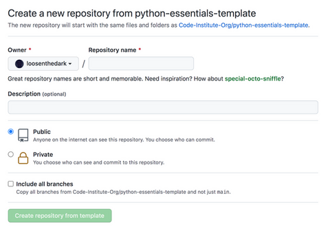

3. On the next screen, select the account you want to own the repository from the **Owner** drop-down menu.

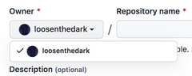

4. Enter a **Repository name**, as well as an optional **Description**.

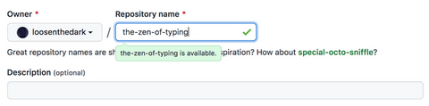

5. Choose a repository visibility. NB: To meet Code Institute project submission criteria, this must be set to **Public**.


6. Click **Create repository from template**.


_For a more detailed explanation, see ['Creating a repository from a template'](https://docs.github.com/en/repositories/creating-and-managing-repositories/creating-a-repository-from-a-template) (GitHub Docs)_
</details>

### Forking the GitHub repository

<details>
  <summary>
    click to view
  </summary>

It is possible to fork this project's GitHub repository to view and/or make changes without affecting the original. This is achieved by following these steps...

_NB: The steps outlined below assume that you already have [Git](https://git-scm.com/) set up on your computer - for an overview of how to download, install, and configure Git, consult the [GitHub Docs](https://docs.github.com/en/github-ae@latest/articles/set-up-git)_

1. [**Sign in** to your GitHub account](https://github.com/login) and locate the [relevant repository](https://github.com/loosenthedark/zen-of-typing).

2. Click on **Fork**, located near the top right-hand corner of the repository page.

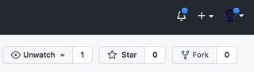

3. You will now have a copy of this project's repository in your own GitHub account.
</details>

### Making a local clone

<details>
  <summary>
    click to view
  </summary>

It is possible to copy the repository to your local machine so that you can fix merge conflicts, add or remove files and push larger commits without affecting the original project code. Cloning a repository pulls down a full copy of all the repo data that GitHub has at that point in time. See the [GitHub Docs](https://docs.github.com/en/github/creating-cloning-and-archiving-repositories/cloning-a-repository) for further information, and below for a brief summary...

1. [**Sign in** to your GitHub account](https://github.com/login) and locate the [relevant repository](https://github.com/loosenthedark/zen-of-typing).

2. Click on the **Code** dropdown next to the green **Gitpod** button. This will reveal the **Clone** option.


3. In order to clone the repository using `HTTPS`, select **HTTPS** and copy the link shown (there is a copy button to the right of the URL).


4. Next, open **Git Bash** (see [here](https://git-scm.com/downloads) for an overview of download options, if required).

5. Change the current working directory on your local machine to the location where you want the cloning to be made.

6. Type `git clone` into your IDE terminal followed by the URL you copied in Step 3 above, i.e.

```
git clone https://github.com/loosenthedark/zen-of-typing.git
```

7. Press **Enter**.

8. Your local clone has now been created.

_See the [GitHub Docs](https://docs.github.com/en/github/creating-cloning-and-archiving-repositories) for more information on all of the above processes._
</details>

### Heroku

<details>
  <summary>
    click to view
  </summary>

The application is deployed on [**Heroku**](https://heroku.com/), and can be accessed using the following URL: https://zen-of-typing.herokuapp.com/

The steps involved in deploying to Heroku were as follows:

1. Create a `requirements.txt` file from the command line, and populate it with a list of project dependencies:

  ```
  pip freeze > requirements.txt
  ```

2. Save, commit and push your changes to GitHub.

3. Create a `Procfile`

  ```
  echo web: node index.js > Procfile
  ```

_NB: This file comes baked-in with the [Code Institute project template repository](https://github.com/Code-Institute-Org/python-essentials-template), so can be skipped if you are using that in your own build_

4. Create an account with Heroku, selecting Python as the primary development language.

5. [Log in to your account](https://id.heroku.com/login), and in the top right-hand corner of the **Dashboard** click on **New > Create new app**


6. Enter a unique name for your app and select your region. Click on **Create app**.

7. Go to **Settings**

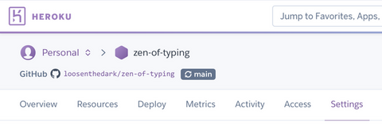

8. Click on the **Reveal Config Vars** button in the 'Config Vars' section.


9. Enter PORT in the KEY field and 8000 in the VALUE field.


10. In the 'Buildpacks' section further down the settings page, click on **Add buildpack**.

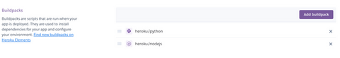

11. Select **python** and **nodejs** from the menu of "officially supported buildpacks".

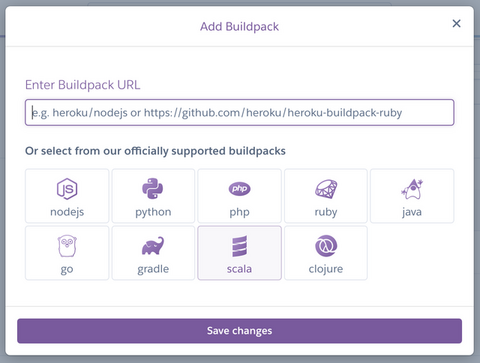

_NB: Python must be placed at the top of your app's buildpack list. You can drag and drop your buildpacks to reposition them if necessary._

12. Go to **Deploy**.

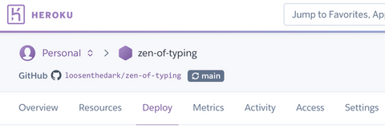

13. Select **GitHub** in the 'Deployment method' section.


14. In the 'Connect to GitHub' section, search for the repository you wish to use, then click **Connect**.


15. Ensure that the project's main or master branch (depending on which is being used as the primary branch) is selected under 'Deploy a GitHub branch' in the 'Manual deploy' section.


_NB: If you choose to **Enable Automatic Deploys**, Heroku will rebuild the app every time you push a change to GitHub (which is considered best practice in most instances)._

16. After clicking on the **Deploy Branch** button, you should see a message confirming that "Your app was successfully deployed" followed by a **View** button which can be clicked to launch and view the app.
</details>

## Credits

### Code

Where code blocks/snippets/suggestions have been incorporated from external sources into this project's code, these have been noted through the use of comments. Beyond this, the developer made use of the following articles, workarounds and learning resources while building the site:
<details>
  <summary>
    click to view
  </summary>

- ['How to let the user select an input from a finite list?'](https://stackoverflow.com/questions/37565793/how-to-let-the-user-select-an-input-from-a-finite-list#comment100075818_37567304) (Stack Overflow)

- ['How to print colored text to the terminal'](https://stackoverflow.com/a/39452138/12176426) (Stack Overflow)

- ['ANSI escape code'](https://en.wikipedia.org/wiki/ANSI_escape_code#SGR_(Select_Graphic_Rendition)_parameters) (Wikipedia)

- ['Ternary Operator in Python'](https://www.geeksforgeeks.org/ternary-operator-in-python/) (GeeksforGeeks)

- ['How to Do Ternary Operator Assignment in Python'](https://www.webucator.com/article/how-to-do-ternary-operator-assignment-in-python/) (Webucator)

- ['How to measure elapsed time in Python?'](https://stackoverflow.com/questions/7370801/how-to-measure-elapsed-time-in-python/7370824#7370824) (Stack Overflow) (as suggested by my [mentor](#acknowledgments))

- ['PEP 257 -- Docstring Conventions'](https://www.python.org/dev/peps/pep-0257/) (Python.org)

- ['Using global variables in a function'](https://stackoverflow.com/questions/423379/using-global-variables-in-a-function) (Stack Overflow)

- ['How to split up a long f-string in python?'](https://stackoverflow.com/questions/48881196/how-to-split-up-a-long-f-string-in-python) (Stack Overflow)

- ['Absolute vs Relative Imports in Python'](https://realpython.com/absolute-vs-relative-python-imports/) (Real Python)

- ['From virtualenv, pip freeze > requirements.txt give TONNES of garbage! How to trim it out?'](https://stackoverflow.com/a/41707616/12176426)

<!-- - ['pep8 warning on regex string in Python, Eclipse'](https://stackoverflow.com/a/19030982/12176426) -->

- ['Create Your Own Python Projects'](https://www.linkedin.com/learning/python-projects-14276284/create-your-own-python-projects) (LinkedIn Learning)

- ['12 Beginner Python Projects - Coding Course'](https://www.youtube.com/watch?v=8ext9G7xspg) (Kylie Ying/freeCodeCamp)
</details>

### Content
<details>
  <summary>
    click to view
  </summary>

- All of the `body` text (game instructions, user feedback etc.) was composed by the developer

- The short introductory practice text is a direct citation lifted from Tom Cargill's ['Ninety-ninety rule'](https://en.wikipedia.org/wiki/Ninety%E2%80%93ninety_rule) (Wikipedia)

- Five of the six target texts provided are abridged versions of external resources that have been redirected into locally-stored `.txt` files. Those external resources are as follows:

  - ['Don't repeat yourself'](https://en.wikipedia.org/wiki/Don%27t_repeat_yourself) (Wikipedia)

  - ['Object-oriented programming'](https://en.wikipedia.org/wiki/Object-oriented_programming) (Wikipedia)

  - ['History of Python' > 'Version 3'](https://en.wikipedia.org/wiki/History_of_Python#Version_3) (Wikipedia)

  - The text content of the project's `sunscreen.txt` file is an edited version of the lyrics to [Baz Luhrmann's 1997 spoken-word single 'Everybody’s Free (To Wear Sunscreen)'](https://genius.com/Baz-luhrmann-everybodys-free-to-wear-sunscreen-lyrics) (Genius)

  - ['PEP 20 -- The Zen of Python'](https://www.python.org/dev/peps/pep-0020/) (Python.org)

- As documented [above](#technologies-used), the sixth list of lines to be typed is in fact a dynamically-loaded response from a [pyjokes API](https://pyjok.es/) end-point.
</details>

### Media
<details>
  <summary>
    click to view
  </summary>

| Media title/description  | Media format  | Credit  | Link to original media source(s)  | 
| :------------ |:--------------- |:-----|:---------------|
| Python icon ASCII art      | `.txt`        | [Matthew Barber (honno) on GitHub](https://github.com/honno)      | [Reddit (Python subreddit)](https://www.reddit.com/r/Python/comments/ifag14/python_logo_in_colored_ascii_art/)      |
| Python background wallpaper      | `.png`        | [Reddit](https://www.reddit.com/r/Python/)      | [Python subreddit](https://styles.redditmedia.com/t5_2qh0y/styles/bannerBackgroundImage_rluqfluf65a51.png?width=4000&s=f108e1238e79b5d46cf4b999a9915a0eb432fd28)      |
| Python logo used to create favicon      | `.svg`        | [Wikipedia](https://en.wikipedia.org/wiki/Python_(programming_language))      | [Wikipedia](https://en.wikipedia.org/wiki/File:Python-logo-notext.svg)      |
| pyjokes logo      | `.png`        | [pyjokes Docs](https://pyjok.es/))      | [pyjokes Docs](https://pyjok.es/images/pyjokes.png)      |
| Typewriter ASCII art      | `.jpg`        | [Pinterest](https://www.pinterest.ie/pin/367958232045511139/))      | [chelleline.com](https://i.pinimg.com/564x/a3/1c/50/a31c500c310594711c751d4243af56ae.jpg)      |
| Computer ASCII art      | `.jpg`        | [Pinterest](https://www.pinterest.ie/pin/288441551133848897/))      | [text-mode.tumblr.com/](https://i.pinimg.com/564x/fb/ce/08/fbce08ffcfd01f555e3ae4c681899d7e.jpg)      |
</details>

### Acknowledgments:

- As with my previous two projects, my number one cheerleader, product tester and source of both inspiration and sanity throughout the current build process has been my amazing partner Ana. _Muito obrigado, menina_ ❤️
- My mentor [Tim Nelson](https://github.com/TravelTimN) was also on hand once more to provide invaluable guidance and encouragement. Among many other things, he helped me identify an issue with my `requirements.txt` file that had escaped my attention 🙌 😅

## Notice

This site has been created for development purposes only.

